 

 

 

## ⚡ pinned

<table width="100%">
<tr>
<td width="50%">
  
</td>
<td width="50%">
  
</td>
</tr>
<tr>
<td width="50%" colspan="2" align="center">
  
</td>
</tr>
</table>

 

## 🧰 stack

 

## 🐍 contribution graph

 

<i>slow and steady. ship anyway.</i>

